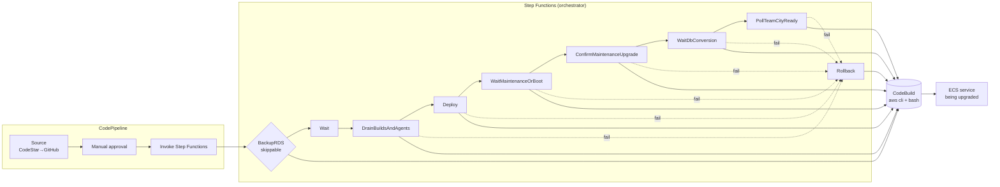

# TeamCity-style ECS Fargate Upgrade POC (stop-before-start)

Tiny AWS stand-in that proves the ECS choreography used for TeamCity upgrades on Fargate:

- `deploymentConfiguration.minimumHealthyPercent=0`
- `deploymentConfiguration.maximumPercent=100`
- `desiredCount=1`
- Deployment circuit breaker + rollback enabled
- EFS volume mounted; marker written by v1, read by v2 after upgrade
- **No NAT, no ALB, no RDS** — default VPC public subnets + `assignPublicIp=ENABLED`
- Fargate `cpu=256` / `memory=512`

This is **not** a real TeamCity+RDS stack (that is not free). It exercises the same stop-before-start ECS pattern.

## Results

See **[PROOF.md](./PROOF.md)** for the 2026-09-06 end-to-end run in account `784318225077` / `eu-west-1`:

- Stop-before-start confirmed (`maxRunningSeenDuringUpgrade=1`, zero-running gap)
- EFS marker survived (`written_by=v1` found by v2)
- Teardown completed; only inactive ECS metadata ARNs remain ($0)

Raw captures live under `proof/`.

## Scripts

| Script | Purpose |
|--------|---------|
| `provision.sh` | SG, EFS, IAM, ECR, cluster, task def v1, service |
| `upgrade.sh` | Register v2 (`APP_VERSION=v2`), force deploy, poll proof |
| `teardown.sh` | Delete all POC resources |
| `scripts/drain-builds-and-agents.sh` | Preflight: wait for 0 running builds; REST-disable agents; optional ECS/ASG scale-in |
| `scripts/poll-tc-ready.sh` | Poll until maintenance page **or** `/app/rest/server` version matches target |
| `scripts/confirm-tc-maintenance-upgrade.sh` | Read Super user token from CloudWatch (or log path / ECS Exec); POST maintenance form |
| `scripts/wait-db-upgrade.sh` | After confirm: wait until maintenance gone **and** REST version == target (long timeout) |

Shared config: `config.env` (no secrets). Runtime IDs go to `.state.env` (gitignored).

## Usage

```bash
# Prerequisites: AWS CLI configured (eu-west-1), Docker (script uses sudo docker), jq
cd /workspace/tc-upgrade-poc   # or clone path
./provision.sh
./upgrade.sh
# review PROOF.md / proof/
./teardown.sh
```

Tags applied: `Project=tc-upgrade-poc`, `Owner=greg`, `KeepUntil=same-day-teardown`.

## App

`app.py` + `Dockerfile` — tiny Python HTTP server on `:8080` that writes `/data/marker.txt` once and serves `APP_VERSION` + marker contents. Health check via `wget`.

## Cost / safety

Prefer free-tier-ish: tiny Fargate, skip RDS/ALB/NAT. Tear down the same session. Do not touch unrelated resources.

## Production orchestration

For a real upgrade (outside this free-tier POC), keep the **orchestrator off the TeamCity being upgraded**:

| Piece | Role |
|-------|------|
| **CodePipeline** | Start + **manual approval** UX |
| **Step Functions** | Orchestrator (waits, drain, deploy, maintenance confirm, DB wait, poll, rollback) |
| **CodeBuild** | Runs upgrade / drain / confirm / poll scripts from this git repo |

Sketch Terraform lives under [`infra/`](./infra/) — **example only; do not blind-apply to prod**. See [`infra/README.md`](./infra/README.md).



ASCII equivalent:

```
CodePipeline:  Source → Manual approval → StartExecution(SFN)

Step Functions:
  BackupRDS? → Wait → DrainBuildsAndAgents → Deploy
      → WaitMaintenanceOrBoot → ConfirmMaintenanceUpgrade
      → WaitDbConversion → PollTeamCityReady → Succeed
  (Drain/Deploy/Confirm/Wait/Poll fail → Rollback task-def → Fail)
  NOTE: after DB conversion, RDS/EFS restore from snapshot is manual/separate.

CodeBuild (NOT on TC host):
  backup | drain-builds-and-agents | upgrade.sh
  | poll-tc-ready | confirm-tc-maintenance-upgrade | wait-db-upgrade | rollback
```

### Execution input (sketch)

Step Functions expects JSON similar to:

```json
{
  "rdsDbInstanceIdentifier": "tc-prod-db",
  "skipRdsBackup": false,
  "previousTaskDefinitionArn": "arn:aws:ecs:...:task-definition/tc:41",
  "teamcityBaseUrl": "https://teamcity.example.com",
  "targetTcVersion": "2025.07.3",
  "teamcityLogGroup": "/ecs/teamcity-server"
}
```

## Major version jump (.2 → .3)

Hard JetBrains facts this repo encodes:

1. **Docker / ECS cannot use TeamCity “Automatic Update”.** You ship a new server image/task definition and let the container boot against existing data.
2. On a **major** jump (e.g. `YYYY.MM.2` → `YYYY.MM.3`), the new container starts in **Maintenance Mode**. Data stays in the **old** format until an admin confirms **Upgrade** on the Maintenance page.
3. Confirm requires the **authentication token** printed in `teamcity-server.log` (“Super user authentication token” / maintenance token).
4. There is **no official REST API** to confirm. Autonomy = read the token from logs + **HTTP POST** the maintenance form. That is the same privilege class as someone with host/log access — which **ECS + CloudWatch** already give the upgrade role.
5. After confirm, **DB/data conversion can take a long time**. Poll until `/app/rest/server` returns the **target version** and login works (`scripts/wait-db-upgrade.sh` + `scripts/poll-tc-ready.sh`).
6. **Downgrade after conversion is not possible** without restoring **RDS** and **EFS** from a **pre-upgrade snapshot**.

### How this PoC automates the UI gate

| Step | Script / state | What happens |
|------|----------------|--------------|
| Preflight | `DrainBuildsAndAgents` → `scripts/drain-builds-and-agents.sh` | Poll `/app/rest/builds?locator=running:true` until count is 0 (optional cancel). Disable agents via REST; optionally scale agent **ECS service to 0** and/or **ASG desired=0**. |
| Deploy | `Deploy` | Stop-before-start ECS deploy of the new server image. |
| Detect gate | `WaitMaintenanceOrBoot` → `poll-tc-ready.sh` | Succeeds when maintenance HTML appears **or** REST already shows target (minor/no-op path). |
| Confirm | `ConfirmMaintenanceUpgrade` → `confirm-tc-maintenance-upgrade.sh` | Prefer `aws logs filter-log-events` on `LOG_GROUP`; optional EFS log path / ECS Exec. Parse maintenance HTML for token field name; POST token + upgrade action. If form structure is unknown, fail with a clear message (one-time capture against your TC version may be needed). |
| Convert | `WaitDbConversion` → `wait-db-upgrade.sh` | Long grace (default ~90 min, override 60–120+): maintenance gone **and** REST version == target. |
| Verify | `PollTeamCityReady` | Final `REQUIRE_VERSION=1` poll. |

### Why Pipeline → Step Functions stays **outside** TeamCity

If the upgrade bricks the server, the orchestrator (CodePipeline + SFN + CodeBuild) must still be able to roll back the **task definition** and operators must still be able to restore **RDS/EFS**. Running the upgrade from a build *inside* the instance being upgraded is how you strand yourself.

### Pre-reqs before a real major jump

- Take an **RDS snapshot** (and EFS backup / sync) — `BackupRDS` in the ASL; do not skip for production majors.
- Allow a **long maintenance window** (conversion + agent drain + grace).
- Ship server logs to **CloudWatch** so `filter-log-events` can find the Super user token.
- Inject `TEAMCITY_BEARER_TOKEN` (or equivalent) into CodeBuild via SSM/Secrets Manager for REST drain — **never commit secrets**.
- **First apply against a real TC should dry-run** `scripts/confirm-tc-maintenance-upgrade.sh` in a **non-prod clone** (capture maintenance HTML once; confirm field names parse; do not rely on guesswork in prod).

### Agent drain patterns

`scripts/drain-builds-and-agents.sh` supports both:

- **REST**: list connected agents → `PUT .../enabled` = `false`; optionally cancel running builds.
- **Compute scale-in**: `AGENT_ECS_CLUSTER` + `AGENT_ECS_SERVICE` → `desiredCount=0`; and/or `AGENT_ASG_NAME` → ASG desired capacity `0`.

Use REST disable so the server stops assigning work; use scale-in so agent containers/instances are actually gone before the server image flips.
